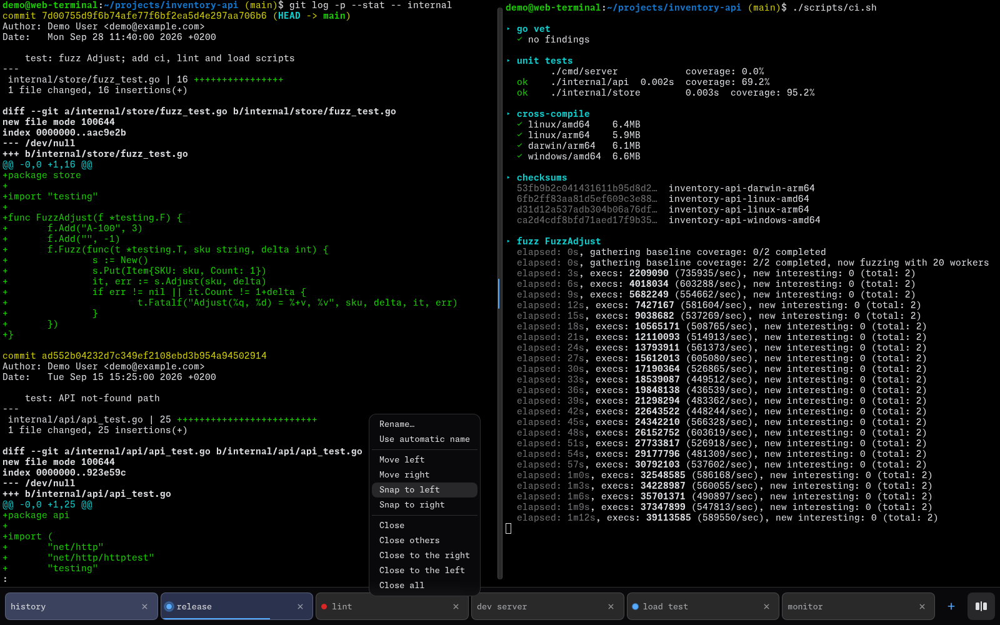

# @cplieger/web-terminal-ui

[](https://www.npmjs.com/package/@cplieger/web-terminal-ui) [](https://jsr.io/@cplieger/web-terminal-ui) [](https://github.com/cplieger/web-terminal-ui/issues?q=label%3Astryker-tracker)

web-terminal-ui builds a browser terminal on [web-terminal-engine](https://github.com/cplieger/web-terminal-engine) that works on a phone as well as a desktop, with tabs, a split view and an on-screen key bar.



It replaces the tabs, key bar, paste menu, IME handling and soft-keyboard resizing you would otherwise build around the engine's renderer. It ships as TypeScript source on npm and JSR, with CSS bundles and a reference page. Its one dependency is the peer `@cplieger/web-terminal-engine` 6.x, and it is licensed under MPL-2.0.

## Why use it

web-terminal-ui is built for a shell or a coding agent served by web-terminal-engine, used from a phone as often as from a desktop.

- One `createTerminal()` call builds the UI inside an element you provide. Four presets cover a single, a touch and two tabbed layouts.
- On a touchscreen it adds a key bar with Tab, Esc, arrows, Enter and a sticky Ctrl, a long-press paste menu and iOS soft-keyboard handling.
- Tabs show activity dots from the program's `OSC 9;4` progress reports and raise browser notifications. Two tabs can sit side by side.
- Native text selection, IME input and dictation work, and predictive echo hides latency.

Consider [xterm.js](https://github.com/xtermjs/xterm.js) if you want a terminal component for any PTY backend, such as node-pty. It has an optional GPU-accelerated renderer and a set of addons, and VS Code uses it. To build a UI of your own on web-terminal-engine, depend on the engine alone.

## Install

```sh
npm install @cplieger/web-terminal-ui @cplieger/web-terminal-engine
npx jsr add @cplieger/web-terminal-ui @cplieger/web-terminal-engine
```

The engine is a peer dependency, so install both.

## Usage

The terminal connects to a server that speaks the engine's [wire protocol](https://github.com/cplieger/web-terminal-engine#wire-protocol), such as one built on the engine's Go `terminal` package or [web-terminal-server](https://github.com/cplieger/web-terminal-server). A plain PTY-over-WebSocket server does not speak it.

```ts
import { createTerminal } from "@cplieger/web-terminal-ui";
import { presetTabbed } from "@cplieger/web-terminal-ui/presets";

createTerminal("#terminal", { features: presetTabbed });
```

Pass the mount target as a selector and the preset as a function, as above. A missing element or a throwing preset then reaches the library's startup-failure handling instead of escaping at your call site. Call `createTerminal` once per document, or `destroy()` the first terminal before you build another.

No prebuilt JavaScript ships, so your build compiles the TypeScript source. Serve the CSS too. For a full-page terminal, join the files listed in `css/MANIFEST` into one stylesheet and serve the Monaspace Neon NF font files at `/vendor/fonts/`. For a terminal inside your own layout, use `css/MANIFEST.single`, `css/MANIFEST.touch` or `css/MANIFEST.tabbed` instead and pass `layout: "container"`. `scaffold/index.html` is a complete page with an import map.

The four presets:

- `presetSingle()` is a desktop terminal with the context menu, clipboard, scroll-to-bottom, predictive echo and connection banner.
- `presetTouch()` adds the key bar.
- `presetTabbed()` adds tabs, activity dots and animations. It needs the engine's session API, which web-terminal-server serves.
- `presetAgentTabbed()` is the same, with each tab's dot shown from the start, for an agent shell.

[Setting up the host page](docs/host-page.md) covers the CSS, the fonts and the presets in full.

## API

- `createTerminal(target, options)` builds the terminal and returns a handle with `focus()`, `send(bytes)`, `reset()`, `reattach()` and `destroy()`, plus `split` under `split: true`. [Options and the terminal handle](docs/configuration.md) lists every option.
- Presets come from `@cplieger/web-terminal-ui/presets`, or one at a time from `/presets/single`, `/presets/touch`, `/presets/tabbed` and `/presets/agent-tabbed`. Single features come from `/features/<name>`.
- `localScrollbackStorage()` is the ready-made storage for the `persistScrollback` option.
- `PUBLIC_THEME_TOKENS` and `LOADING_OVERLAY_CLASSES`, also at `/style-contract`, list the theme keys and the overlay classes. `STARTUP_FAILURE_COPY`, also at `/startup-copy`, holds the failure panel's wording.
- Types cover the options, the handle, features and their context, startup failures and the split controller.

The full reference is on [JSR](https://jsr.io/@cplieger/web-terminal-ui/doc).

## Startup failures and ended sessions

When a startup failure has a place to render, the library shows one "Terminal failed to start" panel with a **Reload** button and lowers your loading overlay. `onFatalError` lets you observe the failure or render your own recovery UI. Two failures draw no panel. One is an embedded terminal whose mount target is missing. The other is a second terminal in a document that already holds a live one.

A session whose process exits shows "Session ended" and does not reconnect. If your endpoint hands out a new session on the next connect, call `reattach()` from `onSessionEnded`, and bound your retries. [Startup failures and ended sessions](docs/failure-handling.md) has the details.

## Security and storage

The library has no login of its own. Authentication and origin checks belong to the server that serves the WebSocket and the session API. Paste reads the Clipboard API, which needs a secure context, so serve the page over HTTPS for touch paste.

Scrollback persistence is off by default, because turning it on writes terminal output to browser storage. An open split view holds up to two WebSocket connections, one per shown pane.

## Related projects

- [web-terminal-engine](https://github.com/cplieger/web-terminal-engine) is the Go session engine and TypeScript renderer this UI is built on.
- [web-terminal-server](https://github.com/cplieger/web-terminal-server) is a ready-to-run container that serves this UI over HTTP and WebSocket for any command.
- [web-terminal-kiro](https://github.com/cplieger/web-terminal-kiro) serves the Kiro CLI in the browser through this UI, as a full page.
- [marotte](https://github.com/cplieger/marotte) is a self-hosted agentic IDE that embeds this UI as its shell panel, in `container` layout.

## Documentation

- [Setting up the host page](docs/host-page.md) covers the CSS, fonts, import map, presets and loading overlay.
- [Options and the terminal handle](docs/configuration.md) lists every option and the theme tokens.
- [Tabs, activity dots and notifications](docs/tabs.md) describes what the tabbed presets show.
- [Split view](docs/split-view.md) covers two panes side by side.
- [Keeping scrollback across a reload](docs/scrollback-persistence.md) covers the `persistScrollback` option.
- [Startup failures and ended sessions](docs/failure-handling.md) covers the Reload panel and `reattach()`.
- [Keyboard, mouse and touch input](docs/input.md) covers focus, paste and mouse reporting.

## Credits

The IME module follows the design of [xterm.js](https://github.com/xtermjs/xterm.js)'s `CompositionHelper`. On a phone, the tab switcher's flick thresholds take [@use-gesture](https://github.com/pmndrs/use-gesture)'s drag defaults, and the five-second composition idle bound comes from [Slate](https://github.com/ianstormtaylor/slate)'s Android input manager. [THIRD_PARTY_NOTICES.md](THIRD_PARTY_NOTICES.md) names the lines that follow each.

## Contributing

Issues and pull requests are welcome. See [CONTRIBUTING.md](CONTRIBUTING.md) for the conventions and how to run the checks locally.

## Disclaimer

This project is built with care and follows security best practices, but it is intended for personal / self-hosted use. No guarantees of fitness for production environments. Use at your own risk.

This project was built with AI-assisted tooling using [Claude](https://claude.com), [GPT](https://openai.com), and [Kiro](https://kiro.dev). The human maintainer defines architecture, supervises implementation, and makes all final decisions.

## License

MPL-2.0. See [LICENSE](LICENSE).

The `Web Terminal Glyphs` tiling overlay named in `css/page.css` is a separate Apache-2.0 work, and its licence travels with the FONT FILE, which this package does not ship. It only names the URL. So no new obligation lands on an npm or JSR consumer. The obligation is the serving host's, which is why the full-page host notes in [Setting up the host page](docs/host-page.md) ask for the font's `LICENSE` and `NOTICE` beside the `.woff2`.

Third-party attributions are in [THIRD_PARTY_NOTICES.md](THIRD_PARTY_NOTICES.md).
